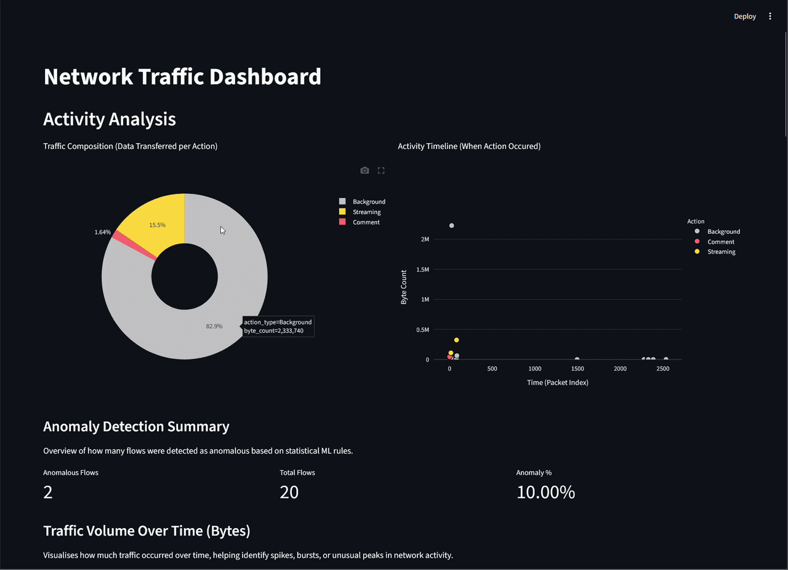

# Network Traffic Profiler Dashboard
An interactive dashboard that helps non-experts understand network traffic from PCAP files through automated classification and visualisation.

With the widespread use of encrypted web traffic, it has become impossible to determine what a user is doing through traditional methods such as by looking at a URL. This system utilises Machine Learning to attempt to profile network data by its shape. By analysing metrics like size, timing and direction of network packets, the system is able to distinguish between different user actions, without needing to decrypt content. **Note:** The current scope of the ML prediction is limited to Youtube browsing.

The developed dashboard allows users without any technical background to explore extracted results from network captures and develop meaningful insights.

## Features
- Upload a `.pcap` file for instant analysis
- Automated feature extraction and data cleaning
- Unsupervised ML for detecting abnormal network activity
- Interactive, beginner-friendly dashboard
- Widely supported open-source Python libraries

## Requirements
**Python 3.11**\
**Virtual Environment (venv)**  

## Installation
```
# Clone the repo
git clone https://github.com/Plymouth-University/comp2003-2025-2026-team-15/  

# Navigate to the /network-traffic-profiler` folder  
# Create a virtual environment
python3.11 -m venv venv  

# Activate the virtual environment - Windows:
venv\Scripts\activate  

# Activate the virtual environment - Unix:
source venv/bin/activate  

# Install dependencies
pip install -r requirements.txt  

# Start Streamlit local web app
streamlit run src/dashboard.py
```

## Example Usage


## Tech Stack
Development language: **Python**\
PCAP parsing: **scapy**\
Feature extraction: **nfstream**\
CSV data storage: **pandas**\
Dashboard: **streamlit**\
Data visualisation: **plotly**\
Testing: **pytest**\
ML: **scikit-learn**

## Pipeline
PCAP Upload -> Feature Extraction -> Schema Validation -> Dataset Preparation -> ML -> Dashboard Visualisation

## Using the dashboard
### Uploading a PCAP
> [!NOTE]
> Files larger than 500MB may incur long processing times and high RAM usage
1. Upload a `.PCAP` or `.PCAPNG`
2. Confirm you have the legal right to process the file
3. Click 'Process PCAP'


### Browsing extracted data
After processing the file, five data tables will appear each providing key insights. The tables are interactive, allowing for sorting and reordering.
Additionally, you can apply filters and toggle table visibility in the sidebar.
1. Top Endpoints - Top 10 IP pairs with the largest byte count
2. Top Conversations - Top 10 network flows
3. All Flows - A list of every identified network flow
4. Anomalous Flows - A list of flows that a RandomForest ML algorithm has identified as containing anomalies
5. Flagged Flows - A list of flows that fail validation rules


### Machine Learning powered action detection
After processing a file a supervised machine learning algorithm attempts to classify flows into actions. A handy interactable piechart displays the predicted information. Currently supported actions include `Stream`, `Search`, `Comment`, `Like`, and `Subscribe`. Analysis is based on key metrics like flow size and inter-arrival time.<br/><br/>


## Training the ML model
> [!NOTE]
> The dataset used to train the ML model is not included in this repo.

Cloning the repo will allow you to use the dashboard straight out of the box, however if you wish to re-train the model you can do so, following a relatively simple process.

1. [Clone the repo](#installation) if you haven't already done so.
1. Head to [SourceCode/network-traffic-profiler/src/ML](SourceCode/network-traffic-profiler/src/ML) in your file explorer.
2. Create a directory `datasets` in [action_classification](SourceCode/network-traffic-profiler/src/ML/action_classification)
3. Create additional directories within `datasets` for any of the actions you wish to train on using the name of the action as the directory name. Supported actions are `Play` (Also referred to as Stream), `Search`, `Comment`, `Like`, and `Subscribe` but you do not need to train the model on all five.
4. Place your PCAPs in the relevant folders.
5. Run [generate_dataset.py](SourceCode/network-traffic-profiler/src/ML/action_classification/generate_dataset.py). This will create a CSV file `master_training_data.csv` in [ML/model_training](SourceCode/network-traffic-profiler/src/ML/model_training) containing all the extracted features the model uses.
6. Run [model_training/train_model.py](SourceCode/network-traffic-profiler/src/ML/model_training/train_model.py) which will train the model, producing 3 `.pkl` files in [src/ML](SourceCode/network-traffic-profiler/src/ML). Several tests will be performed to give you information on accuracy and how to improve the model.
7. Start streamlit and check the results.

## Tests
Unit tests are included to validate the feature extraction, data processing and data validation. Run all tests by using the `pytest` command.

## Contributing
This project forms part of a larger project, which aims to develop an AI-driven firewall intrusion detection system, designed for small to medium-sized businesses, and will be further developed in the future.

## Documentation
Find our Design Documents [Here](https://github.com/Plymouth-University/comp2003-2025-2026-team-15/tree/0e4070ed433bc7e53d49b43b76898e0fa8a27ccc/Design%20Documents)

## License
Licensing to be confirmed based on client requirements.
