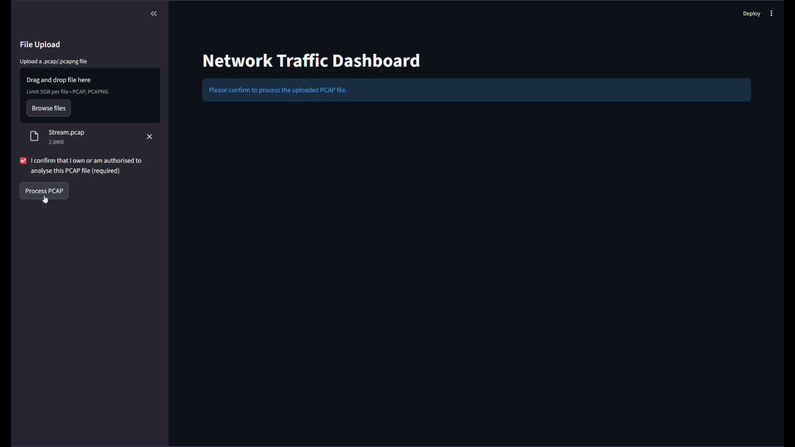
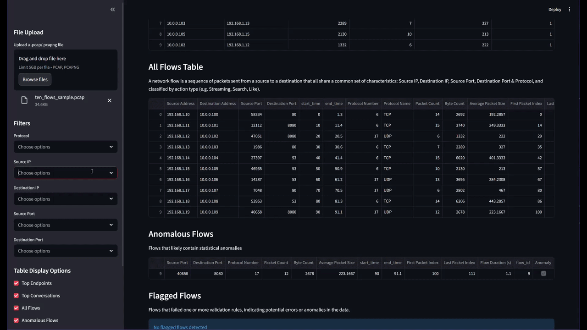
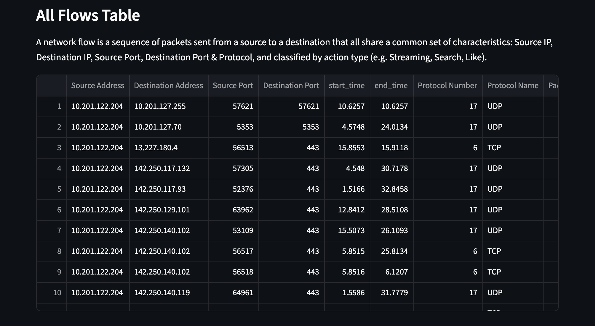
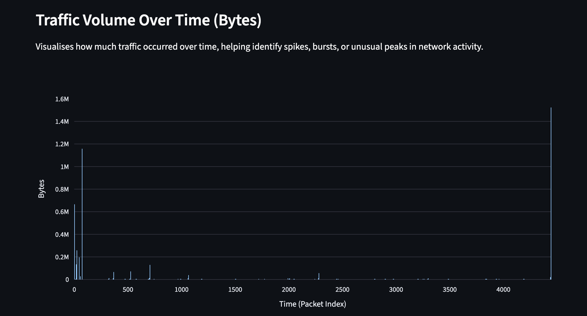
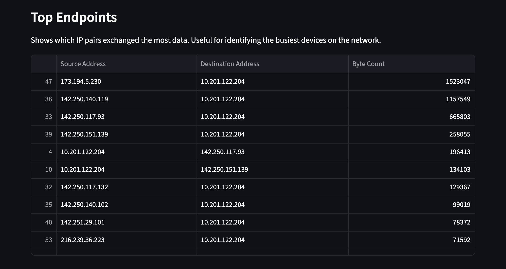
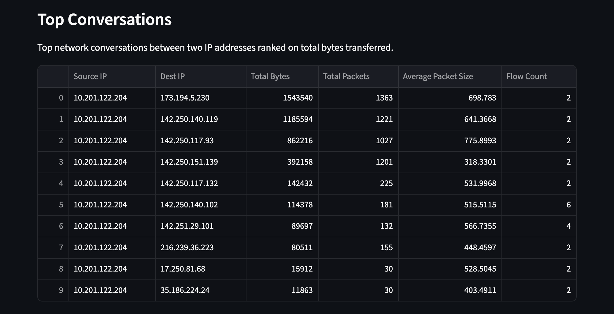
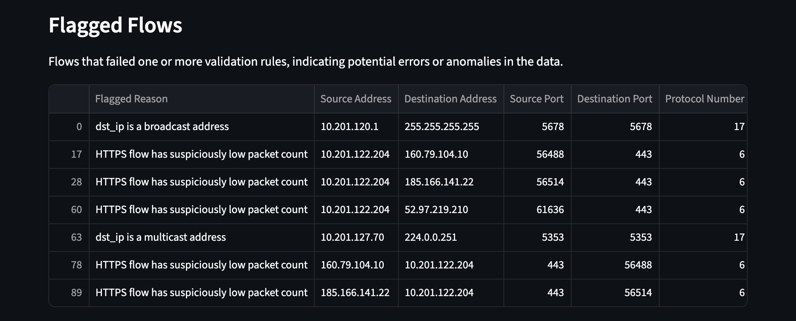
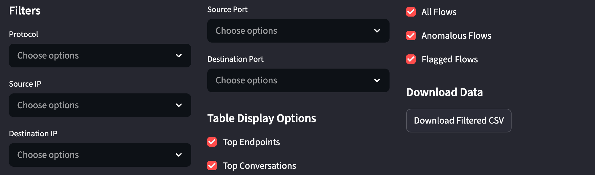
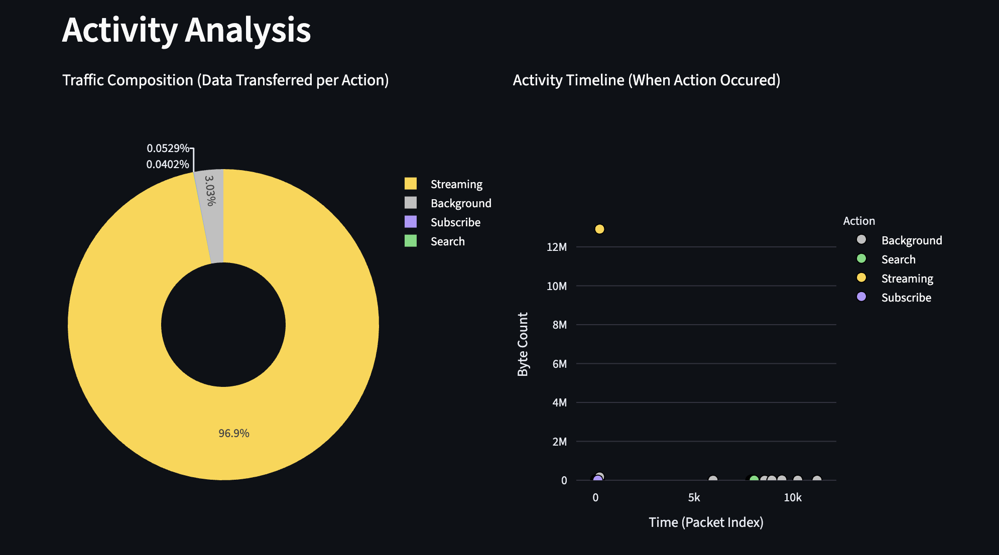
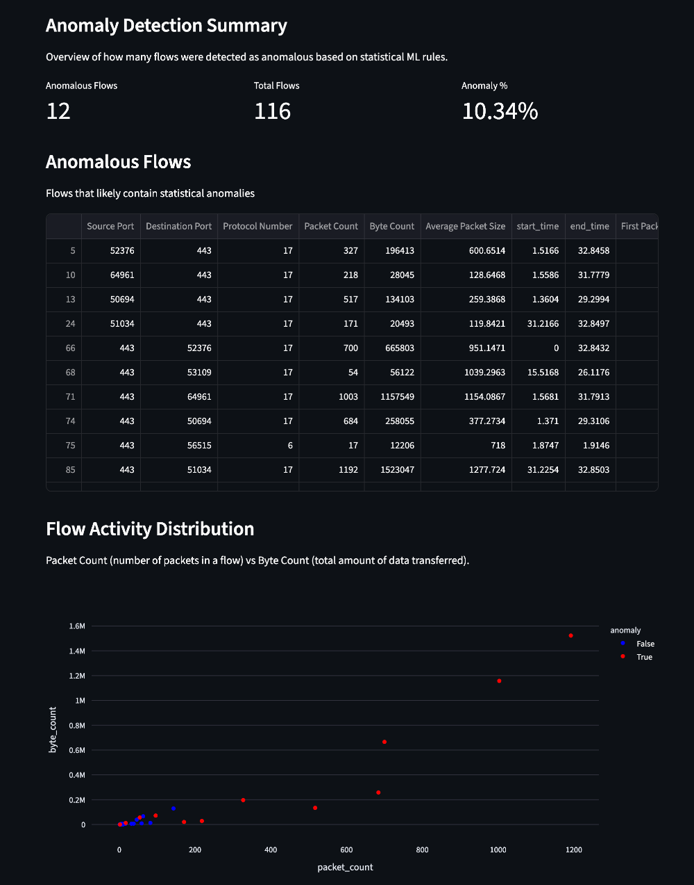

# Network Traffic Profiler Dashboard
An interactive dashboard that helps non-experts understand network traffic from PCAP files through automated classification and visualisation.

With the widespread use of encrypted web traffic, it has become impossible to determine what a user is doing through traditional methods such as by looking at a URL. This system utilises Machine Learning to attempt to profile network data by its shape. By analysing metrics like size, timing and direction of network packets, the system is able to distinguish between different user actions, without needing to decrypt content. **Note:** The current scope of the ML prediction is limited to Youtube browsing.

The developed dashboard allows users without any technical background to explore extracted results from network captures and develop meaningful insights.

## Table of Contents

- [Dashboard Usage](#dashboard-usage)
- [Features](#features)
- [Tech Stack](#tech-stack)
- [Requirements](#requirements)
- [Installation](#installation)
- [Training the ML model](#training)
- [Automation](#automation)
- [Purpose](#purpose)
- [Documentation](#documentation)
- [License](#license)

## Dashboard Usage
### Uploading a PCAP
> [!NOTE]
> Files larger than 500MB may incur long processing times and high RAM usage
1. Upload a `.PCAP` or `.PCAPNG`
2. Confirm you have the legal right to process the file
3. Click 'Process PCAP'



### Browsing extracted data
After processing the file, five data tables will appear, each providing key insights. The tables are interactive, allowing for sorting and reordering.



## Features

Understand network activity through the following tables, including beginner-friendly explanations:

#### 1. All Flows

A list of every identified network flow



#### 2. Traffic Volume Over Time

A time graph showing how much traffic occured over time



#### 3. Top Endpoints & Conversations

Top 10 network flows & IP pairs with the largest byte count





#### 4. Flagged Flows

A list of flows that fail validation rules



#### Filtering & CSV file download

Filters can be applied to toggle visibility. Additionally, the selected network data can be downloaded as sorted .CSV file.



### User action prediction

The uploaded PCAP file runs through the trained model, attempting to predict a users' actions.

The model uses a supervised machine learning algorithm, based on key metrics like flow size and inter-arrival time.

A interactable piechart and timeline display the predicted actions.

Currently supported actions include `Stream`, `Search`, `Comment`, `Like`, and `Subscribe`.



### Anomaly detection

A list of flows that a an unsupervised IsolationForest algorithm has identified as containing anomalies, based on values differing from the norm.
**Note: This feature is still in development and may not display accurate results.**



## Tech stack
The application is developed using Python as main development language.

### Python Libraries
The used open-source libraries are widely supported, ensuring long-term compatibility.

PCAP parsing: `scapy`  
Feature extraction: `nfstream`  
CSV data storage: `pandas`  
Dashboard: `streamlit`  
Data visualisation: `plotly`  
Testing: `pytest`  
ML: `scikit-learn`  

### Localhost
The application currently runs on localhost, meaning data doesn't get stored externally, ensuring a high level of privacy.

## Requirements
**Python 3.11**\
**Virtual Environment (venv)**  

## Installation
```
# Clone the repo
git clone https://github.com/Plymouth-University/comp2003-2025-2026-team-15/  

# Navigate to the /network-traffic-profiler` folder  
# Create a virtual environment
python3.11 -m venv venv  

# Activate the virtual environment - Windows:
venv\Scripts\activate  

# Activate the virtual environment - Unix:
source venv/bin/activate  

# Install dependencies
pip install -r requirements.txt  

# Start Streamlit local web app
streamlit run src/dashboard.py
```

## Training
> [!NOTE]
> The dataset used to train the ML model is not included in this repo.

Cloning the repo will allow you to use the dashboard straight out of the box, however if you wish to re-train the model you can do so, following a relatively simple process.

1. [Clone the repo](#installation) if you haven't already done so.
1. Head to [SourceCode/network-traffic-profiler/src/ML](SourceCode/network-traffic-profiler/src/ML) in your file explorer.
2. Create a directory `datasets` in [action_classification](SourceCode/network-traffic-profiler/src/ML/action_classification)
3. Create additional directories within `datasets` for any of the actions you wish to train on using the name of the action as the directory name. Supported actions are `Play` (Also referred to as Stream), `Search`, `Comment`, `Like`, and `Subscribe` but you do not need to train the model on all five.
4. Place your PCAPs in the relevant folders.
5. Run [generate_dataset.py](SourceCode/network-traffic-profiler/src/ML/action_classification/generate_dataset.py). This will create a CSV file `master_training_data.csv` in [ML/model_training](SourceCode/network-traffic-profiler/src/ML/model_training) containing all the extracted features the model uses.
6. Run [model_training/train_model.py](SourceCode/network-traffic-profiler/src/ML/model_training/train_model.py) which will train the model, producing 3 `.pkl` files in [src/ML](SourceCode/network-traffic-profiler/src/ML). Several tests will be performed to give you information on accuracy and how to improve the model.
7. Start streamlit and check the results.

## Automation
A CI pipeline is configured through GitHub Actions, installing environment dependencies, checking code quality using Lint, confirming existing files and running unit and integration tests using the `pytest` command on each new commit.

## Purpose
This project forms part of a larger project, which aims to develop an AI-driven firewall intrusion detection system, designed for small to medium-sized businesses, and will be further developed in the future.

## Documentation
Find our Design Documents [Here](https://github.com/Plymouth-University/comp2003-2025-2026-team-15/tree/0e4070ed433bc7e53d49b43b76898e0fa8a27ccc/Design%20Documents)

## License
This project is licensed under the [MIT License](LICENSE).
